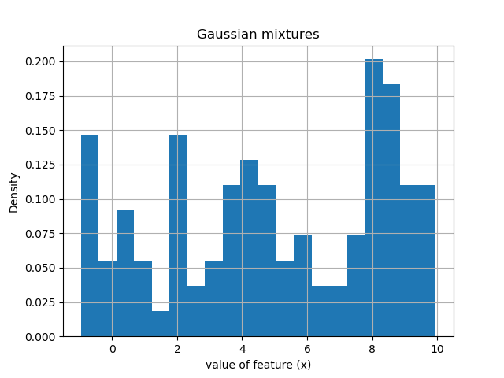
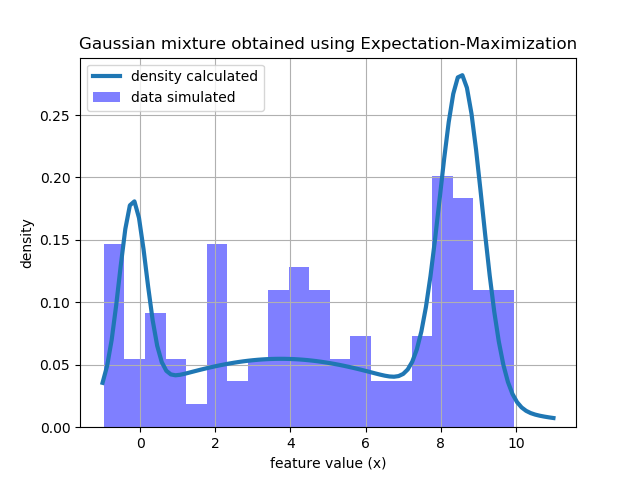

# Gaussian Mixture Model

$$
P(X|\lambda) \sim \sum_i^M w_i Normal(X|\mu_i , \Sigma_i)
$$

where 

* X is the data
* $\lambda$ is the model parameters ($\mu , \Sigma, w_i $)

* $w_i$ is the weight of the $i​$ Mixture component
* $\mu_i$ is the mean of the $i$ mixture component 
* $\Sigma_i​$ is the covariance matrix for the mixture component

## Algorithm 1: Expectation-Maximization

The expectation-maximization is a point estimate of the maximum log-likelihood with an E-step (assignment step) which calculate the probability of each latent variables given the parameters $\lambda$ and an M-step which calculate the parameter that maximize the lower bound.

### E-step

$$
p(i|x_n) = \frac{p(i)Normal(x_n|\mu_i, \Sigma_i)}{\sum_k p(k)Normal(x_n|\mu_k, \Sigma_k)}
$$

### M-step

$$
\mu_i = \frac{\sum_n p(i|x_n) x_n}{\sum_n p(i|x_n) }
$$

$$
\Sigma_i = \frac{\sum_n p(i|x_n)(x_n - \mu_i)(x_n - \mu_i )^T}{\sum_n p(i|x_n) }
$$

Notes:

* The EM-algorithm is know to get stuck in local minimum. We thus make many random restarts and keep the best result. 

